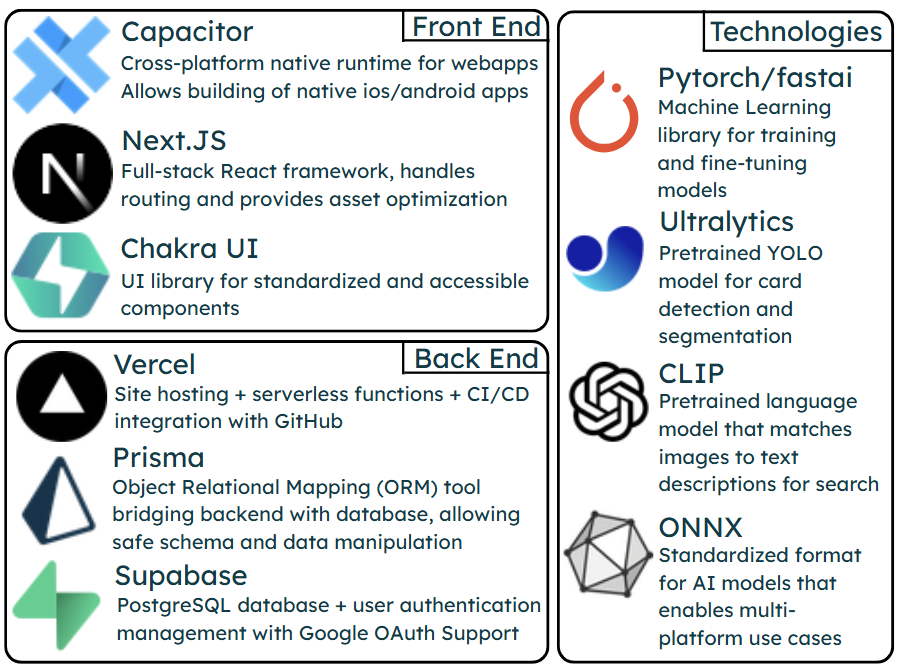

  
<h3 align="center">Kollec</h3>

  

    A platform for Pokémon card collectors to catalogue their collection, showcase their best finds, and trade together.
     
     <a href="https://kollec.app/" target="_blank" rel="noopener noreferrer">Start Collecting!</a>
  

## Demo

<!-- Add a demo video or GIF here -->

## Table of Contents

<ol>
  <li>
    <a href="#about-the-project">About The Project</a>
  </li>
  <li><a href="#built-with">Built With</a></li>
  <li><a href="#getting-started">Getting Started</a></li>
  <li><a href="#contributors">Contributors</a></li>
  <li><a href="#contact">Contact</a>
    <ol>
        <li><a href="#emails">Emails</a></li>
    </ol>
  </li>
</ol>

## About The Project

Kollec is a secure and centralized card collection platform built for collectors by collectors. We're starting _not so small_ with Pokémon cards!

Users can easily setup an account, create a profile, and start cataloguing their collection. Kollec allows for users to quickly and easily digitize their expansive Pokémon card collection using their device's camera to identify cards in real time.

With Kollec, users can easily keep track of their collection and seamlessly navigate through it, while connecting with other collectors to trade cards together.

Using Next.js and Capacitor, Kollec can seamlessly run in your browser and as a native Apple or Android app. With Supabase, Prisma ORM, and Vercel’s serverless functions, your data remains readily available and secure at all times.

## Built With

### Front End

- [Capacitor](https://capacitorjs.com/)
- [Next.js](https://nextjs.org/)
- [Chakra UI](https://chakra-ui.com/)

### Back End

- [Vercel](https://vercel.com/home)
- [Prisma ORM](https://www.prisma.io/)
- [Supabase](https://supabase.com/)

### Technologies

- [Pytorch](https://pytorch.org/)
- [Ultralytics](https://github.com/ultralytics/ultralytics)
- [OpenCV CLIP](https://opencv.org/clip/)
- [ONNX](https://onnx.ai/)

## Getting Started

Kollect has already been deployed online and the complete version is available for use at [kollec.app](https://kollec.app/), accessible from any device with a web browser (access from desktop or Android mobile devices is recommended for the best experience).

A native android app available on the Google Play Store and an iOS app available on the Apple App Store hoping to be released in the near future. 

For developers interested in contributing to the project, please refer to the [CONTRIBUTING.md](CONTRIBUTING.md) file for guidelines on how to get started.

## Contributors

## Contact

Feel free to contact any of the contributing developers if you have any questions or want to get involved!

### Emails:
- Kenneth Ong - [kennethkvs060103@gmail.com](mailto:kennethkvs060103@gmail.com)
- Elite Lu - [elitelulww@gmail.com](mailto:elitelulww@gmail.com)
- Geon Youn - [geon.youn@outlook.com](mailto:geon.youn@outlook.com)
- Ishpreet Nagi - [ishpreetnagi@gmail.com](mailto:ishpreetnagi@gmail.com)
- James Nickoli - [jnick722547@gmail.com](mailto:jnick722547@gmail.com)
- Norman Liang - [norman.liang.00@gmail.com](mailto:norman.liang.00@gmail.com)
- Tania Da Silva - [dasilvata02@gmail.com](mailto:dasilvata02@gmail.com)
